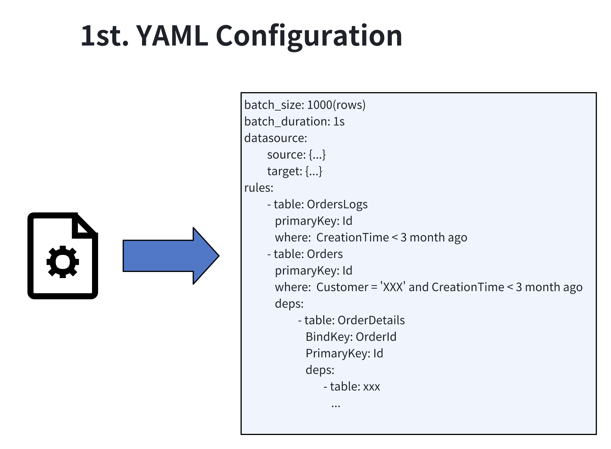
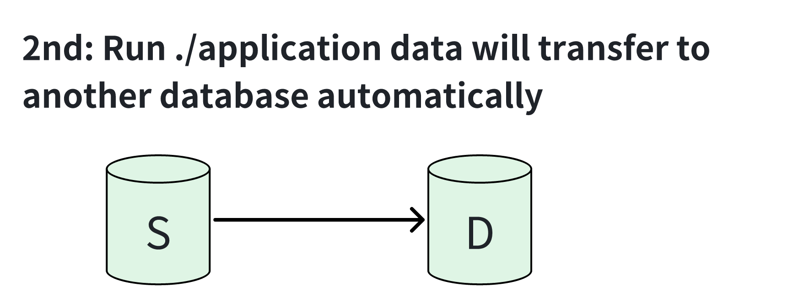

# mysql-archiver

Language: [Chinese](README.md)

## Introduction

This is a tool designed for MySQL cross-server archiving scenarios. It can transfer data from instance A to instance B. Currently, it supports single-table archiving and multi-table cascading archiving, meeting most archiving needs.  
When using this tool, you only need to define the archiving parameters (such as batch size, archiving interval, transaction isolation level, etc.) and archiving rules through YAML. The rest of the cyclic archiving actions are handled by `mysql-archiver`~  

### !!! For DBAs to release their hands !!!

  
  

---

## Usage

1. Please prepare your Docker environment or Golang environment (requires >=1.21.10).  
2. Run the build script `build.sh`.  
3. Modify the YAML configuration file according to your needs ([see configuration file instructions](#configuration-file-explanation)).  
4. Run the program.

---

# Configuration File Explanation

```yaml
global:
  batch_size: 100      # Archive batch size; i.e., the number of rows of data extracted from each table based on the condition
  sleep: 1s            # Interval between batches
  datasource:          # Configuration for the data source
    transaction_isolation: REPEATABLE READ     # Transaction isolation level of the source database
    src:               # Source database (username, password, database name, etc.)
      addr: 127.0.0.1:3306
      user: root
      pass: "1234"
      dbname: test
    dst:               # Archive target database
      addr: 192.168.66.3:3306
      user: root
      pass: "123456"
      dbname: aaa
rules:                 # Archiving rules configuration (each rule is executed in the order defined, from top to bottom, until all data in the current table is archived before moving on to the next table)
  # Example of single-table archiving
  - table: ApplicationLogs
    where: CreationTime < DATE_SUB(DATE(NOW()), INTERVAL 6 MONTH)
    pk: Id

  # Example of multi-table cascading archiving
  - table: Orders         # Name of the primary table
    where: 1=1            # Archiving condition
    pk: Id                # Primary key name
    deps:                 # Dependencies for child tables
      - table: OrderDetails       # Name of the child table
        pk: DetailId              # Primary key name of the child table
        key: OrderId              # Key name associated with the primary table's primary key
  - table: products
    where: 1 = 1
    pk: product_id
    deps:
      - table: product_packages
        pk: package_id
        key: product_id
        deps:
          - table: package_barcodes
            pk: barcode_id
            key: package_id
```